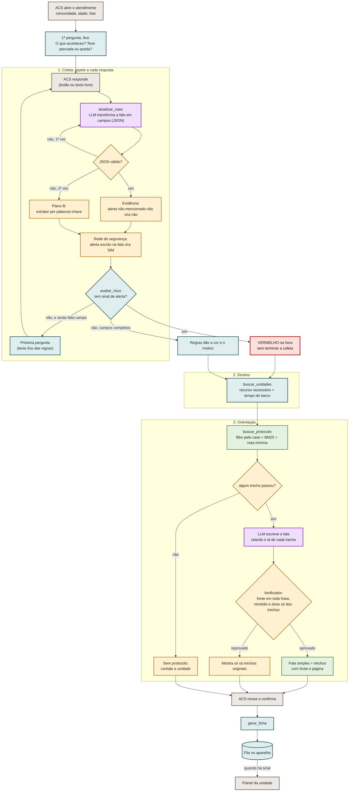

# Triagem ACS · agente de triagem de hematoma offline

Um assistente de IA para o **Agente Comunitário de Saúde (ACS)** de comunidades ribeirinhas.
Ele conversa sobre um caso de **mancha roxa (hematoma)**, dá a **cor de risco**, indica **para qual
unidade levar** (pelo recurso que o caso precisa, não pela distância) e **o que fazer agora**, com o
trecho do protocolo do Ministério da Saúde que embasa cada orientação.

Tudo roda **no próprio computador, sem internet**: o modelo de linguagem é local (Ollama), a busca nos
protocolos é local (BM25) e a ficha fica numa fila até haver sinal.

> **AKCIT Camp 2026 · Hackathon Norte.** MVP web; no produto, vira app (PWA) para Android.

---

## Sumário

1. [Em uma frase: quem decide o quê](#em-uma-frase-quem-decide-o-quê)
2. [**Fluxo do agente: inputs, lógica e outputs**](#fluxo-do-agente-inputs-lógica-e-outputs)
   - [Diagrama](#diagrama)
   - [Inputs](#inputs)
   - [Lógica, passo a passo](#lógica-passo-a-passo)
   - [Outputs](#outputs)
   - [Guardrails](#guardrails)
   - [Exemplo completo](#exemplo-completo-caso-da-demo)
3. [Como rodar](#como-rodar)
4. [Estrutura do repositório](#estrutura-do-repositório)
5. [Avaliação](#avaliação)
6. [Limitações e próximos passos](#limitações-e-próximos-passos)

---

## Em uma frase: quem decide o quê

| Quem | Faz | Nunca faz |
|---|---|---|
| **LLM local** (qwen3:8b no Ollama) | Entende a fala do ACS e transforma em campos do caso; escreve a orientação em linguagem simples a partir dos trechos do protocolo | Decidir a cor, baixar o risco, inventar conduta |
| **Código (regras fixas)** | Decide a próxima pergunta, a cor, o motivo, os recursos necessários e o destino; monta a ficha | — |
| **RAG (protocolos)** | Busca os trechos do Ministério da Saúde que valem para o caso | Orientar sem fonte |
| **ACS** | Responde, revisa e confirma | — é sempre dele a palavra final |

---

## Fluxo do agente: inputs, lógica e outputs

### Diagrama



Legenda: roxo = LLM · azul = código e regras · verde = protocolo (RAG) · âmbar = proteção · cinza = pessoas.

### Inputs

**Do ACS, no atendimento**

| Input | Forma | Obrigatório | Para que serve |
|---|---|---|---|
| Comunidade | texto livre (com sugestões) | sim | Ponto de partida do cálculo de destino (tempo de barco) |
| Idade | número | não | Regra "pancada na cabeça em idoso (65+)" |
| Foto da mancha | imagem (reduzida no aparelho, até 5 MB) | não | Vai anexada à ficha. **Não é analisada** pela IA: a gravidade de um hematoma não está na foto |
| Respostas | botão de resposta rápida **ou** texto livre, informal | sim | A fala vira campos do caso |

O ACS pode contar tudo de uma vez ("manchas roxas nas pernas, sem pancada, febre há 4 dias, gengiva
sangrando"): o agente extrai todos os campos que a fala traz e **pula as perguntas já respondidas**.
Esse é o motivo de ser um agente e não um formulário.

**Campos do caso** (o que a conversa precisa descobrir)

| Caminho | Campos |
|---|---|
| Os dois | `pancada` (define o caminho), `crescendo`, `sangramento_nao_para`, `anticoagulante` |
| Com pancada | `local` (cabeça, peito, barriga, braço, perna), `mecanismo` (queda de altura, barco, moto, pancada leve, outro), `sinais_cabeca`, `dor_forte_ou_falta_ar`, `deformidade`, `mexe_apoia` |
| Sem pancada | `febre`, `sangramento_mucosa` (gengiva, nariz, xixi), `petequias`, `picada_cobra`, `cansaco_palidez` |

Cada campo de sim/não aceita `true`, `false` ou `"nao_sei"`. **"Não sei" conta como SIM** (pior cenário).

**Dados locais (já no aparelho, sem internet)**

| Input | Arquivo | Conteúdo |
|---|---|---|
| Regras de risco | `app/regras.py` | Sinais de alerta, critérios de cor, perguntas, ordem das perguntas |
| Unidades | `dados/unidades.json` | Unidades, recursos de cada uma e tempo de barco a partir de cada comunidade (**fictícios na demo**) |
| Protocolos | `rag/docs/`, `rag/curados/*.json`, `rag/fontes.json` | PDFs do Ministério da Saúde e trechos curados com tipo, subtipo, condição e palavras do ACS |
| Modelo | Ollama (`qwen3:8b`, 4 bits) | Roda no Mac, raciocínio desligado (~3 s por chamada) |

### Lógica, passo a passo

#### 1. Abertura

O código abre o caso e faz a primeira pergunta, **fixa** ("O que aconteceu? Teve alguma pancada ou
queda?"), porque ela divide o atendimento em dois caminhos: **com pancada** (trauma) e **sem pancada**
(doença: dengue, coagulação, picada de cobra).

#### 2. Coleta (repete a cada resposta)

1. **`atualizar_caso` (LLM):** a fala do ACS vai para o modelo junto com o estado do caso e a
   pergunta feita. O modelo devolve **só JSON**: `{"acao": "atualizar_caso", "campos": {...}}`.
2. **Validação (Pydantic):** cada campo é conferido. JSON inválido → **uma nova tentativa** com aviso
   → se falhar de novo, **plano B: extrator por palavras-chave**. Valor inválido num campo (ex.: `"testa"`
   em vez de `"cabeca"`) é descartado e completado pelas palavras-chave.
3. **Evidência:** se o ACS **não mencionou** um sinal de alerta, o modelo não pode responder "não" ou
   "não sei" por ele. Sem essa regra, um "não" inventado faria o agente nunca perguntar aquele sinal.
4. **Rede de segurança:** o código procura sinais de alerta no **texto bruto** do ACS ("golfou",
   "tá sem ar", "jararaca"…). Se achar um que o modelo deixou passar, marca SIM. Entende negação antes e
   depois da palavra ("não vomitou", "febre não teve") sem apagar outro sintoma ("não vomitou, mas tá
   sonolenta" → sonolência = SIM).
5. **O risco nunca baixa:** um sinal de alerta já marcado como SIM não volta para NÃO.
6. **Pior cenário:** se o mesmo campo for perguntado 2 vezes sem resposta clara, o agente assume o
   pior (ex.: local desconhecido → cabeça).
7. **`avaliar_risco` (regras):** roda **a cada resposta**, com o caso ainda incompleto. Se já há sinal
   de alerta, **encerra na hora em vermelho**. Se não, pega o próximo campo que falta, na ordem das
   regras (alertas primeiro), e faz a pergunta — um texto fixo, com uma ideia só, para que "Sim",
   "Não" e "Não sei" tenham um sentido só.

#### 3. Classificação (só regras, sem LLM)

**Vermelho: qualquer sinal de alerta**, e o recurso que o destino precisa ter:

| Sinal de alerta | Recurso |
|---|---|
| Vômito, sono forte ou confusão depois de pancada na cabeça | tomografia |
| Dor forte na barriga ou falta de ar depois da pancada | tomografia + centro cirúrgico |
| Braço ou perna torto, frio ou sem conseguir mexer | raio-X |
| Mancha roxa sem pancada, com febre e sangue na gengiva, nariz ou xixi (sinal de alarme da dengue) | exame de sangue + hidratação na veia |
| Mancha roxa depois de picada de cobra | soro antiofídico |
| Mancha roxa aumentando rápido / sangramento que não para | exame de sangue (+ centro cirúrgico se houve pancada) |

**Sem sinal de alerta**, com o caso completo (laranja e amarelo são **proposta** da equipe, a validar):

| Cor | Com pancada | Sem pancada |
|---|---|---|
| **Laranja** | Queda de altura, barco ou moto · pancada na cabeça em idoso (65+) · pancada na cabeça em quem toma remédio que afina o sangue | Febre (pode ser dengue) · sangue na gengiva, nariz ou xixi, ou pontinhos vermelhos |
| **Amarelo** | Pancada na cabeça, no peito ou na barriga sem alerta · toma remédio que afina o sangue | Cansaço ou palidez · remédio que afina o sangue · mancha sem outro sinal |
| **Verde** | Pancada leve no braço ou na perna, mexe normal, sem alerta | — |

Se vários critérios valem, fica a cor mais grave, com todos os motivos dessa cor.

#### 4. Destino (`buscar_unidades`, código)

Entre as unidades que têm **todos** os recursos do caso, escolhe a de **menor tempo de barco** a partir
da comunidade. Se a mais próxima não serve, a explicação diz o que falta nela. Verde → fica em casa,
com revisita do ACS em 24 a 48 h. Comunidade fora da tabela → sem destino, "contate a unidade de
referência".

> Por que tempo de barco e não distância: no rio, um posto a 5 km do outro lado de um igarapé pode
> estar a 2 h de rabeta. O tempo depende da cheia/seca, da correnteza e do barco.

#### 5. Orientação (`buscar_protocolo` + LLM + verificador)

1. **Filtro pelo caso**, não pela pergunta livre: caminho (com/sem pancada) e condição (cabeça,
   membro, dengue, cobra, remédio). Caso vermelho ou laranja **nunca** recebe trecho de "quando voltar"
   ou "pode ficar em casa".
2. **BM25** ordena os trechos pelos termos do caso e pelas palavras do ACS. Trechos curados pesam 1,5×.
   Abaixo da nota mínima, o trecho é descartado.
3. Escolhe até 4: o melhor de cada tipo (o que fazer, o que não fazer, sinais de alerta, quando voltar).
4. **Sem trecho, sem orientação:** "Sem protocolo para essa situação, contate a unidade".
5. O LLM escreve a fala **só com os trechos**, citando o id do trecho em cada frase.
6. **Verificador:** frase sem citação é removida; citação de trecho que não foi recuperado, remédio ou
   dose que não estão nos trechos → a fala inteira é barrada e o app mostra **só os trechos originais**.

#### 6. Confirmação e ficha

O ACS revisa e confirma. `gerar_ficha` grava a ficha numa fila local (SQLite). **Sem sinal**, ela fica no
aparelho; **com sinal**, vai para o painel da unidade, com a hora prevista de chegada (hora do envio +
tempo de barco). Na demo, o sinal é um botão simulado; o modelo sem internet é real.

### Outputs

**Para o ACS (tela de resultado)**

| Output | Exemplo |
|---|---|
| Cor + ação | **Emergência** · Encaminhar agora |
| Motivos | "Mancha roxa sem pancada, com febre e sangue na gengiva, nariz ou xixi (sinal de alarme da dengue)" |
| Pior cenário assumido | "Sem resposta clara sobre vômito, sono ou confusão. Por segurança, o agente considerou que sim." |
| Destino | Unidade Mista de Vila Nova · 2h de barco · "A mais próxima (UBS Boa Esperança, 30 min) não tem exame de sangue e hidratação na veia." |
| O que fazer agora | Fala simples com números que apontam para os trechos, e os trechos com fonte e página |

**Painel de raciocínio** (cada passo, na ordem, com entrada, saída e tempo): mostra se quem agiu foi
o LLM, uma regra, o protocolo, uma proteção ou o ACS. Passos possíveis:
`abrir_caso`, `pergunta_padrao`, `atualizar_caso`, `validar_json`, `validar_campos`, `sem_evidencia`,
`conflito_pancada`, `complemento_palavras`, `fallback_palavras`, `nao_baixa_risco`, `rede_seguranca`,
`pior_cenario`, `avaliar_risco`, `buscar_unidades`, `buscar_protocolo`, `escrever_orientacao`,
`frase_sem_fonte_removida`, `verificador`, `anexar_foto`, `confirmar`, `gerar_ficha`.

**Ficha (painel da unidade)**: cor, motivos, idade, comunidade, destino, tempo de barco, chegada
prevista, campos do caso, status da orientação e foto. Ordenada com o vermelho primeiro.

**API**: todas as rotas devolvem o caso completo em JSON (`historico`, `passos`, `classificacao`,
`destino`, `orientacao`). Contrato em [API.md](API.md).

### Guardrails

| Risco | Proteção |
|---|---|
| LLM baixar a cor | A cor vem só das regras; sinal de alerta SIM não volta para NÃO |
| LLM perder um alerta | Rede de segurança no texto bruto; alertas checados a cada resposta |
| LLM "responder" o que o ACS não disse | Regra de evidência: "não"/"não sei" só com menção na fala |
| JSON quebrado ou modelo fora do ar | 1 nova tentativa → extrator por palavras-chave → pergunta padrão |
| Resposta vaga | 2 tentativas → pior cenário |
| Conduta inventada | Sem trecho, sem orientação; fonte em toda frase; remédio e dose só dos trechos |
| Orientar "ficar em casa" num caso grave | Trechos de "quando voltar" e de caso leve bloqueados em vermelho/laranja |
| Decisão automática | O ACS revisa e confirma; o assistente apoia, não diagnostica |

### Exemplo completo (caso da demo)

Comunidade: São João do Lago · modelo: qwen3:8b · wi-fi desligado.

```text
Assistente  O que aconteceu? Teve alguma pancada ou queda?
ACS         manchas roxas nas pernas, sem pancada, febre há 4 dias, gengiva sangrando

atualizar_caso [LLM]      {pancada: false, local: perna, febre: true, sangramento_mucosa: true}   ~3 s
avaliar_risco  [regra]    VERMELHO: sinal de alarme da dengue → exame de sangue + hidratação na veia
buscar_unidades [regra]   Unidade Mista de Vila Nova, 2h de barco
                          (a mais próxima, UBS Boa Esperança, 30 min, não tem esses recursos)
buscar_protocolo [RAG]    dengue_sinais_alerta, dengue_nao_fazer_aas, dengue_cuidados_hidratacao, ...
escrever_orientacao [LLM] (resumido) "Procure atendimento imediatamente [1]. Não dê AAS nem
                          anti-inflamatório [2]. Comece a hidratação oral [3]."                   ~8 s
verificador    [código]   aprovado: toda frase com fonte, nenhum remédio fora dos trechos
```

Uma resposta, ~12 s, e a coleta termina: o sinal de alarme dispensa as outras perguntas.

---

## Como rodar

Requisitos: **Python 3.9+** e [Ollama](https://ollama.com) (testado em Mac com chip Apple, 24 GB). Node só para mexer no front.

```bash
git clone https://github.com/Davibrasil05/NexusAi.git && cd NexusAi
python3 -m venv .venv && .venv/bin/pip install -r requirements.txt
```

**Modelo local** (uma vez, com internet): instale o app do Ollama (ollama.com) e baixe o modelo.

```bash
ollama pull qwen3:8b
```

**Protocolos**: coloque os PDFs em `rag/docs/` e os trechos curados em `rag/curados/`
(guia em [rag/COMO_ALIMENTAR.md](rag/COMO_ALIMENTAR.md)), depois monte o índice:

```bash
.venv/bin/python -m rag.indexar
```

**App** (API + front já compilado em `web/`):

```bash
LLM_PROVEDOR=ollama .venv/bin/uvicorn app.main:app --port 8000
```

- Tela do ACS: http://localhost:8000
- Painel da unidade: http://localhost:8000/web/#/painel
- Sem o modelo (`LLM_PROVEDOR=mock`, o padrão), o app roda com um LLM simulado por palavras-chave.

**Terminal** (sem front, com o painel de raciocínio):

```bash
.venv/bin/python scripts/conversar.py --llm ollama --passos
```

**Front** (React + Tailwind): `cd front && npm install && npm run dev` para desenvolver;
`npm run build` gera `web/`, que a API serve.

| Variável | Padrão | O que faz |
|---|---|---|
| `LLM_PROVEDOR` | `mock` | `mock` ou `ollama` |
| `LLM_MODELO` | `qwen3:8b` | Modelo do Ollama |
| `LLM_TIMEOUT_S` | `30` | Tempo máximo por chamada |
| `LLM_REESCREVE_PERGUNTA` | `0` | `1` deixa o LLM reescrever as perguntas (mais lento, texto variável) |
| `RAG_LIMIAR` | `0.5` | Nota mínima do BM25 (calibrar com os PDFs reais) |
| `RAG_TOP_K` | `4` | Máximo de trechos por orientação |

---

## Estrutura do repositório

```
app/
  main.py          API FastAPI (rotas em API.md)
  agente.py        loop do agente: coleta, guardrails, destino e orientação
  regras.py        sinais de alerta, cores, perguntas (sem LLM)
  palavras.py      extrator por palavras-chave (plano B e rede de segurança)
  prompts.py       prompts do LLM (entender a fala, escrever a orientação)
  unidades.py      destino por recurso + tempo de barco
  orientador.py    busca no protocolo a partir do caso
  fichas.py        ficha e fila offline (SQLite)
  modelos.py       schemas Pydantic
  llm/             contrato do LLM, cliente Ollama e LLM simulado
rag/               extração de PDF, indexação, busca BM25, verificador, trechos curados
dados/             unidades.json (fictício), fichas.db e fotos (gerados)
front/             código do front (React + Tailwind + Vite)
web/               front compilado (servido pela API; versionado para a demo rodar sem Node)
avaliacao/         casos de teste e scripts de avaliação
scripts/           conversar no terminal e testar modelos
```

---

## Avaliação

| Teste | O que mede | Resultado (qwen3:8b) |
|---|---|---|
| `avaliacao/golden.json` · 24 casos | Cor, destino e trechos, do início ao fim | **0 grave classificado como leve** · 24/24 cores · 24/24 destinos · 0 orientação sem fonte |
| `avaliacao/extracao.json` · 34 falas | Entendimento da fala, campo a campo | 91% dos campos pelo modelo; no agente: **0 alerta perdido**, 0 resposta inventada |

```bash
.venv/bin/python avaliacao/avaliar.py --llm ollama
.venv/bin/python avaliacao/avaliar_extracao.py --llm ollama
```

O `avaliar.py` sai com erro se algum caso grave for classificado como leve.

---

## Limitações e próximos passos

- **Dados da demo:** unidades, comunidades e tempos de barco são fictícios. No produto: unidades e
  recursos do **CNES**, tempos pela hidrografia (ANA/OpenStreetMap) ajustados pelos ACS, tabela
  sincronizada quando há sinal; o GPS (funciona sem internet) sugere a comunidade.
- **Protocolos:** os trechos curados precisam ser conferidos nas páginas dos PDFs oficiais
  (aparecem como "a conferir no PDF" até lá).
- **Regras laranja/amarelo** são proposta da equipe e precisam de validação clínica.
- **Fora do MVP:** voz (transcrição local), análise da foto, app instalável com o modelo no aparelho,
  outros módulos no mesmo molde (picada de cobra, queimadura, feridas), fine-tuning com dados de piloto.
